  <h2 class="text-3xl font-bold text-white mb-4">Scan to ask questions</h2>
  

    
  

---
layout: center
class: text-center
transition: slide-up
---

    

  <h1 class="text-6xl font-bold tracking-tight text-white">Cursor Meetup Riyadh</h1>
  <h2 class="text-3xl text-[#6E6E6E]">May 28, 2025</h2>
  
Welcome to the Future

---
layout: center
class: text-center
transition: fade-out
---

  <h2 class="text-3xl font-bold text-white mb-4">Our Partners</h2>
  

    

      

          
      

      
Hosting Partner

    

    

      

          
      

      
Community Partner

    

  

---
layout: two-cols
layoutClass: gap-8
class: px-6
---

# Agenda

  <h2 class="text-xl font-bold mb-4">Part 1</h2>

  
  

    

      7:00pm
      🯠Meetup Introduction
      @ma7dev
    

  

  
  

    

      7:15pm
      👨‍💻 Cursor Team Talk & Q&A
      @danperks_
    

  

  
  

    

      7:30pm
      🔧 Everything About Cursor
      @ma7dev
    

  

  
  

    

      8:00pm
      ☕ Break
      10 minutes
    

  

::right::

  <h2 class="text-xl font-bold mb-4">Part 2</h2>

  

    

      8:10pm
      🖥️ Local Models w/ Cursor
      @AbdoMosaibah
    

  

  
  

    

      8:30pm
      🧠 Memory Bank & Adv. Usage
      @ma7dev
    

  

  
  

    

      9:00pm
      🤠Networking
      
    

  

  
  

    

      9:30pm
      🉠Event End
      
    

  

---
layout: section
class: text-center
background: '#171717'
transition: slide-up
---

# Meetup Introduction

🎯

Setting the stage for our Cursor journey
---
layout: center
class: px-8
transition: slide-up
---

  

  

  

  

    
  

  
  

      <h2 class="text-lg text-white font-semibold">Mazen Alotaibi</h2>
      
Senior ML Engineer at <a href="https://maala.tech" class="text-white">Malaa Technologies</a>

      
MSc AI and BSc CS from <a href="https://oregonstate.edu" class="text-white">Oregon State University</a>

      
2023 PyTorch Ambassador Award & Cursor Ambassador

      
Accelerating technology and AI development in 🇸🇦

      
<a href="https://ma7.dev" class="text-white">ma7.dev</a> | <a href="https://x.com/ma7dev" class="text-white">@ma7dev</a>

  

  
👀 Next Chapter

---
layout: center
class: px-8 bg-[#033D22]
background: '#033D22'
style: 'background-color: #033D22 !important;'
---

  

    
  

---
layout: center
class: px-8
transition: slide-up
---

# Cursor

---
layout: center
class: px-8
transition: slide-up
---

  

  

  

    <h3 class="text-2xl font-bold text-white mb-4">Anysphere (parent company)</h3>
    <ul class="text-left text-[#6E6E6E] space-y-2">
      <li>$9B valuation (May 2025)</li>
      <li>$900M funding raised</li>
      <li>Fastest-growing AI startup</li>
    </ul>
  

  

    <h3 class="text-2xl font-bold text-white mb-4">Cursor (the product)</h3>
    <ul class="text-left text-[#6E6E6E] space-y-2">
      <li>AI-native code editor</li>
      <li>Built on VS Code foundation</li>
      <li>~1B lines of code generated daily</li>
    </ul>
  

---
layout: center
class: px-8
---

# Why This Meetup?

  
  

    

      🌍
    

    <h3 class="text-xl font-bold text-white mb-3">Knowledge Sharing</h3>
    
Learning from global best practices

  

  

    

      👥
    

    <h3 class="text-xl font-bold text-white mb-3">Developer Community</h3>
    
Building a strong local AI development ecosystem

  

  
  

    

      🚀
    

    <h3 class="text-xl font-bold text-white mb-3">Innovation Hub</h3>
    
Positioning Riyadh as an AI development center

  

  

    

      🇸🇦
    

    <h3 class="text-xl font-bold text-white mb-3">Vision 2030</h3>
    
Aligning with Saudi Arabia's tech transformation

  

---
layout: center
class: px-8
---

# What to expect

  

    <h3 class="text-xl font-bold text-white mb-3">In-person</h3>
    <ul class="text-[#6E6E6E] space-y-2">
      <li>Talks by local experts</li>
      <li>Hands-on workshops</li>
      <li>Networking opportunities</li>
    </ul>
  

  

    <h3 class="text-xl font-bold text-white mb-3">On Discord</h3>
    <ul class="text-[#6E6E6E] space-y-2">
      <li>Sharing knowledge, tips, and tricks</li>
      <li>Virtual hackathons (with prizes)</li>
      <li>Community discussions</li>
    </ul>
  

<!-- join discord use qr images -->

    
    
Cursor Meetup Riyadh

---
layout: section
class: text-center
background: '#171717'
transition: slide-up
---

# Cursor Team Talk

👨‍💻

Direct insights from the Cursor engineering team

---
layout: center
class: text-center px-8
---

  

    
  

  
  

    <h2 class="text-2xl font-bold mb-2">Dan Perks</h2>
    
User Operations at Anysphere

    

      
Working to improve Cursor's user experience from end to end

    

  

---
layout: section
class: text-center
background: '#171717'
transition: slide-up
---

# Everything About Cursor

🔧

Deep dive into Cursor's capabilities and practical usage

---
layout: center
class: px-8
---

# How LLMs Work (The Basics)

  

    
📝

    <h3 class="text-xl font-bold mb-3">Input</h3>
    
Your prompt + context

  

  
  

    
→

  

  
  

    
🧠

    <h3 class="text-xl font-bold mb-3">Model</h3>
    
Neural network predicts next tokens

  

  
  

    
→

  

  
  

    
✨

    <h3 class="text-xl font-bold mb-3">Output</h3>
    
Generated code/text

  

---
layout: center
class: px-8
---

# LLMs in Code Editors Made Simple

    

    

      <h4 class="font-bold">🎯 You Say:</h4>
      
"Make this button green"

    

    

      <h4 class="font-bold">👀 AI Sees:</h4>
      
Your code + files + request

    

    

      <h4 class="font-bold">🧠 AI Thinks:</h4>
      
"Based on patterns, this needs CSS changes"

    

    

      <h4 class="font-bold">✨ AI Delivers:</h4>
      
Updated code with green button

    

  

  
  

    

      <h3 class="text-xl font-bold mb-4 text-center">🔑 The Secret</h3>
      
Better Context = Better Results

      <ul class="mt-4 text-sm text-[#6E6E6E] space-y-2">
        <li>Include relevant files</li>
        <li>Describe your goal clearly</li>
        <li>Show error messages</li>
        <li>Provide examples when helpful</li>
      </ul>
    

  

---
layout: center
class: text-center px-8
---

# Cursor: The Smart Middle-Man

```mermaid {scale: 0.9, theme: 'dark'}
graph LR
    A[👨‍💻 You] -->|Request| B[🎯 Cursor]
    B -->|Enhanced Context| C["🧠 Model Providers (OpenAI, Anthropic, etc.)"]
    C -->|Response| B
    B -->|Formatted Code + Suggestions| A
    
    style A fill:#171717,stroke:#6E6E6E,color:#fff
    style B fill:#0F0F0F,stroke:#fff,color:#fff
    style C fill:#171717,stroke:#6E6E6E,color:#fff
```

---
layout: center
class: text-center px-8
---

# Core Cursor Features

  

    <h3 class="text-xl font-bold mb-2">⭐ Cursor Tab</h3>
    
Next-gen autocomplete

    <ul class="text-xs space-y-1 list-disc list-inside text-left">
      <li>Multi-line suggestions</li>
      <li>Cross-file awareness</li>
      <li>Fusion Tab Model</li>
    </ul>
  

  

    <h3 class="text-xl font-bold mb-2">⌨️ CMD+K</h3>
    
Inline code magic

    <ul class="text-xs space-y-1 list-disc list-inside text-left">
      <li>Quick edits</li>
      <li>Natural language commands</li>
      <li>Instant refactoring</li>
    </ul>
  

  

    <h3 class="text-xl font-bold mb-2">💬 Chat</h3>
    
AI coding partner

    <ul class="text-xs space-y-1 list-disc list-inside text-left">
      <li>Four powerful modes</li>
      <li>Contextual assistance</li>
      <li>Background agents</li>
    </ul>
  

---
layout: two-cols
layoutClass: gap-16
class: px-8
---

  <h3 class="text-xl font-bold mb-4">🤖 Agent Mode</h3>
  <ul class="text-sm text-[#6E6E6E] space-y-2 list-disc list-inside">
    <li>Autonomously learns codebase</li>
    <li>Makes codebase-wide changes</li>
    <li>Background processing</li>
    <li>Perfect for large refactors</li>
  </ul>

  <h3 class="text-xl font-bold mb-4">❓ Ask Mode</h3>
  <ul class="text-sm text-[#6E6E6E] space-y-2 list-disc list-inside">
    <li>Get code explanations</li>
    <li>Plan new features</li>
    <li>Understand complex logic</li>
    <li>Educational and exploratory</li>
  </ul>

::right::

  <h3 class="text-xl font-bold mb-4">🎯 Manual Mode</h3>
  <ul class="text-sm text-[#6E6E6E] space-y-2 list-disc list-inside">
    <li>Focused edits with your context</li>
    <li>Full control over AI visibility</li>
    <li>Perfect for sensitive code</li>
    <li>Precise, controlled assistance</li>
  </ul>

  <h3 class="text-xl font-bold mb-4">⚙️ Custom Mode</h3>
  <ul class="text-sm text-[#6E6E6E] space-y-2 list-disc list-inside">
    <li>Create workflow-specific modes</li>
    <li>Tailor AI behavior to team needs</li>
    <li>Unlimited customization</li>
    <li>Enterprise-ready configurations</li>
  </ul>

---
layout: center
class: px-8
---

# Chat Modes Deep Dive

---
layout: center
class: text-left px-8
---

# Features

- **🎯 Context Enhancements**: Smarter file and directory inclusion
- **📚 Docs**: Enable AI to use human-readable documentation as context
- **🎯 Rules**: Set up user-specific or project-specific rules to guide AI behavior
- **📝 AI Commit Messages**: Intelligent git commit generation  
- **💾 Checkpoints**: Restore previous states easily
- **🔗 Multi-Root Workspaces**: Manage multiple repositories
- **🏗️ Model Context Protocol (MCP)**: Interact with external tools
- (NEW) **🔄 Background Agent**: Parallel task execution (linting, testing, docs)
- and much more...

---
layout: center
class: px-8 text-center
---

# Live Demo
Cursor in action

---
layout: center
class: px-8
---

# Common Pitfalls to Avoid

1. ❌ **Vague requests** without sufficient context
2. ❌ **Ignoring error messages** and logs in your requests
3. ❌ **Not using project rules** to guide AI behavior
4. ❌ **Overwhelming AI** with irrelevant information
5. ❌ **Expecting perfection** on first try - iterate!
6. ❌ **Not exploring models** - each has its strengths

---
layout: center
class: px-8
---

# Best Practices & Tips

1. **🎯 Context is King**: Provide clear, relevant context
2. **🔍 Provide error messages**: AI can't fix what it doesn't know about
3. **📋 Use Rules**: Set up project-specific guidelines
4. **🔍 Leverage @ Symbols**: Be explicit about what you want
5. **🔄 Iterate**: Start broad, then refine your requests
6. **🧪 Experiment**: Try different models for different tasks

---
layout: center
class: px-8
---

# Pricing

  

    <h3 class="text-xl font-bold mb-4">🆓 Hobby</h3>
    
Free

    
Includes:

    <ul class="text-sm text-[#6E6E6E] space-y-2">
      <li>Pro two-week trial</li>
      <li>2,000 completions per month</li>
      <li>50 slow requests per month</li>
    </ul>
  

  

    <h3 class="text-xl font-bold mb-4">💼 Pro</h3>
    
$20/month

    
Everything in Hobby, plus:

    <ul class="text-sm text-[#6E6E6E] space-y-2">
      <li>Unlimited completions</li>
      <li>500 fast requests per month</li>
      <li>Unlimited slow requests</li>
      <li>Max Mode (useful for large codebases and complex tasks)</li>
    </ul>
  

  

    <h3 class="text-xl font-bold mb-4">🏢 Business</h3>
    
$40/user/month

    
Everything in Pro, plus:

    <ul class="text-sm text-[#6E6E6E] space-y-2">
      <li>Enforce privacy mode org-mode</li>
      <li>Centeralized team billing</li>
      <li>Admin dashboard with usage stats</li>
      <li>SALM/OIDC SSO</li>
    </ul>
  

  
Cursor for Students: Free for 1 year with academic email

  
Source: Cursor.com, May 2025 | Enterprise plans available with custom pricing

---
layout: section
class: text-center
background: '#171717'
---

# Break Time ☕

⏰

---
layout: section
class: text-center
background: '#171717'
---

# Local Models with Cursor

🖥️

Running AI models locally with Cursor - Demo by @AbdoMosaibah

---
layout: section
class: text-center
background: '#171717'
transition: slide-up
---

# Memory Bank & Advanced Usage

🧠

Using Cursor for everything - Demo by @ma7dev

---
layout: section
class: text-center
background: '#171717'
transition: slide-up
---

# This Section Has Two Parts

  

    <h3 class="text-2xl font-bold text-white mb-3">🧠 Memory Bank</h3>
    
Giving Cursor Agent the steering wheel (vibe-coding)

  

  

    <h3 class="text-2xl font-bold text-white mb-3">🚀 Advanced Usage</h3>
    
Using Cursor for everything (beyond coding)

  

---
layout: center
class: px-8
transition: slide-up
---

# What is Memory Bank?

  

    <h3 class="text-xl font-bold mb-4">🧠 Concept</h3>
    <ul class="text-sm text-[#6E6E6E] space-y-2">
      <li>Inspired by <a href="https://docs.cline.bot/prompting/cline-memory-bank" class="text-white underline">Cline Memory Bank</a></li>
      <li>Gives LLMs more context to plan and act</li>
      <li>Human-readable AI contract</li>
      <li>Updates and evolves over time</li>
    </ul>
  

  

    <h3 class="text-xl font-bold mb-4">🎯 Purpose</h3>
    <ul class="text-sm text-[#6E6E6E] space-y-2">
      <li>Persistent project knowledge</li>
      <li>Context that survives sessions</li>
      <li>Intelligent task planning</li>
      <li>Continuous learning from progress</li>
    </ul>
  

---
layout: center
class: px-8
transition: slide-up
---

# Memory Bank: Three Parts

  

    
⚙️

    <h3 class="text-xl font-bold mb-3">Setup</h3>
    
Define project foundation

  

  
  

    
🧠

    <h3 class="text-xl font-bold mb-3">Planning</h3>
    
Initialize & review progress

  

  
  

    
🚀

    <h3 class="text-xl font-bold mb-3">Execution</h3>
    
Implement & update

  

---
layout: center
class: px-8
transition: slide-up
---

# Part 1: Setup

  <h3 class="text-2xl font-bold mb-6 text-center">⚙️ Foundation Building</h3>
  
  

    

      <h4 class="text-lg font-bold mb-3">📝 Define Project Description</h4>
      <ul class="text-sm text-[#6E6E6E] space-y-2">
        <li>Project goals and objectives</li>
        <li>Technical requirements</li>
        <li>Architecture decisions</li>
        <li>Team conventions</li>
      </ul>
    

    

      <h4 class="text-lg font-bold mb-3">🔄 Iterate & Refine</h4>
      <ul class="text-sm text-[#6E6E6E] space-y-2">
        <li>Use Cursor Agent to help</li>
        <li>Refine based on feedback</li>
        <li>Update as project evolves</li>
        <li>Keep it human-readable</li>
      </ul>
    

  

---
layout: center
class: px-8
transition: slide-up
---

# Part 2: Planning

  <h3 class="text-2xl font-bold mb-6 text-center">🧠 Strategic Thinking</h3>
  
  

    

      <h4 class="text-lg font-bold mb-3">🤖 Model Choice</h4>
      <ul class="text-sm text-[#6E6E6E] space-y-2">
        <li><strong>o3</strong> (expensive but powerful)</li>
        <li><strong>Sonnet-4</strong> (balanced option)</li>
        <li>Choose based on complexity</li>
      </ul>
    

    

      <h4 class="text-lg font-bold mb-3">📋 Process</h4>
      <ol class="text-sm text-[#6E6E6E] space-y-2">
        <li>Initialize memory bank with Agent</li>
        <li>Review memory bank content</li>
        <li>Iterate & refine memory bank (especially progress)</li>
      </ol>
    

  

---
layout: center
class: px-8
transition: slide-up
---

# Part 3: Execution **(Sonnet-4)**

  

    

      <h4 class="font-bold">1. Start Fresh</h4>
      
Always start with a new chat

    

    

      <h4 class="font-bold mb-2">2. Implement and interact w/ AI</h4>
      <ul class="text-sm text-[#6E6E6E]">
        <li>Start with progress context</li>
        <li>Review changes actively</li>
        <li>Interact with AI</li>
      </ul>
    

    

      <h4 class="font-bold mb-2">3. Complete & Update</h4>
      <ul class="text-sm text-[#6E6E6E]">
        <li>Review git changes</li>
        <li>Take code ownership</li>
        <li>Update memory bank before next task</li>
      </ul>
    

  

---
layout: center
class: text-center px-8
transition: slide-up
---

# Live Demo
Memory Bank in Action

---
layout: center
class: text-center px-8
transition: slide-up
---

# Using Cursor for Everything

  

    <h3 class="text-lg font-bold mb-4">💻 Development</h3>
    <ul class="text-left text-sm text-[#6E6E6E] space-y-1">
      <li>Code generation & refactoring</li>
      <li>Bug fixing & debugging</li>
      <li>Documentation writing</li>
      <li>Test creation</li>
    </ul>
  

  

    <h3 class="text-lg font-bold mb-4">📝 Beyond Code</h3>
    <ul class="text-left text-sm text-[#6E6E6E] space-y-1">
      <li>Technical writing</li>
      <li>Architecture planning</li>
      <li>Code reviews</li>
      <li>Learning new technologies</li>
    </ul>
  

  

    <h3 class="text-lg font-bold mb-4">🏢 Team Workflows</h3>
    <ul class="text-left text-sm text-[#6E6E6E] space-y-1">
      <li>Onboarding new developers</li>
      <li>Code style enforcement</li>
      <li>Knowledge sharing</li>
      <li>Project standardization</li>
    </ul>
  

  

    <h3 class="text-lg font-bold mb-4">🚀 Advanced Usage</h3>
    <ul class="text-left text-sm text-[#6E6E6E] space-y-1">
      <li>Custom model integration</li>
      <li>Workflow automation</li>
      <li>Multi-project management</li>
      <li>Performance optimization</li>
    </ul>
  

---
layout: center
class: text-center px-8
transition: slide-up
---

# Q) Does anyone use Obsidian?

<v-click>

# Q) Does anyone use Perplexity?

</v-click>

---
layout: center
class: text-center px-8
transition: slide-up
---

---
layout: center
class: text-center px-8
transition: slide-up
---

# Live Demo
Obsidian + Perplexity + Cursor

---
layout: center
class: px-8 text-center
---

# Next Steps & Resources

  

    <h3 class="text-lg font-bold mb-4 text-white">🚀 Try Cursor</h3>
    
Download and start your free trial

  

  

    <h3 class="text-lg font-bold mb-4 text-white">👥 Join Community</h3>
    
Discord, forums, local groups

  

  

    <h3 class="text-lg font-bold mb-4 text-white">📚 Learn More</h3>
    
docs.cursor.com for comprehensive guides

  

  

    <h3 class="text-lg font-bold mb-4 text-white">🔄 Future Meetups</h3>
    
Monthly sessions with advanced topics

  

---
layout: end
class: text-center px-8
---

# Thank You! 🙏

  <h2 class="text-2xl font-bold mb-4">Let's Connect & Build Together</h2>
  
<a href="https://x.com/ma7dev" class="text-white">@ma7dev</a> & <a href="https://x.com/AbdoMosaibah" class="text-white">@AbdoMosaibah</a>

  
Follow for more AI development insights

<!-- Brought to you by Cursor circular stamp -->

  

---
layout: center
class: text-center px-8
---

# Networking Time! 🤝

  <h2 class="text-3xl font-bold mb-8">Let's build the future together</h2>

<!-- join discord use qr images -->

    
    
Cursor Official

<!-- join discord use qr images -->

    
    
Cursor Meetup Riyadh

